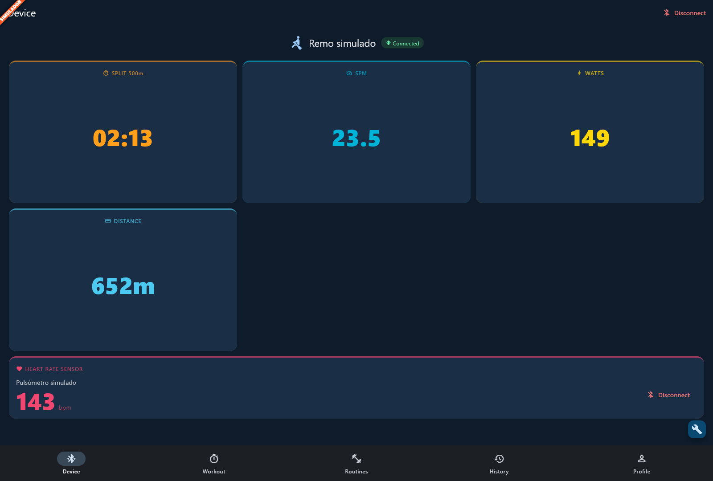
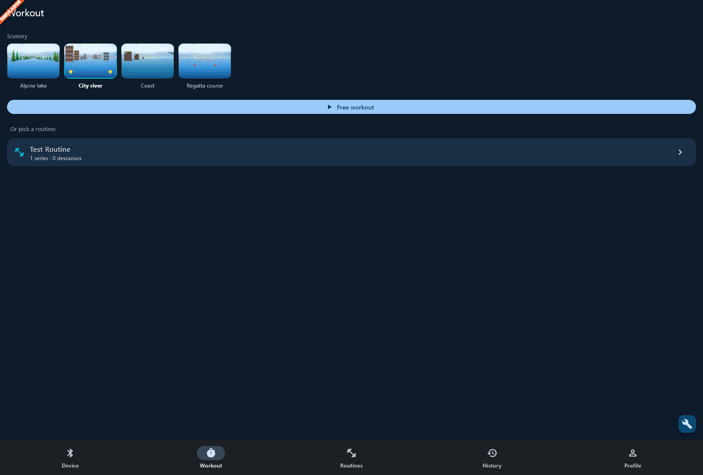
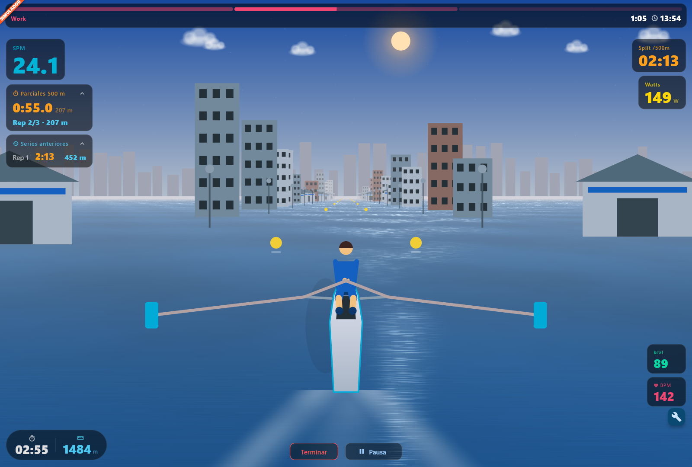
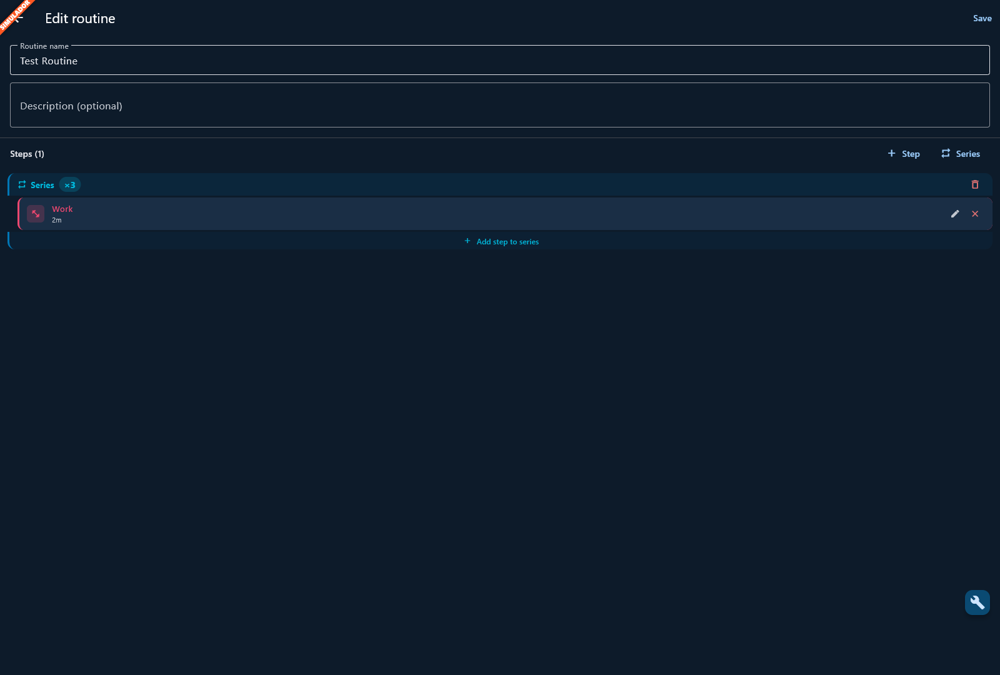
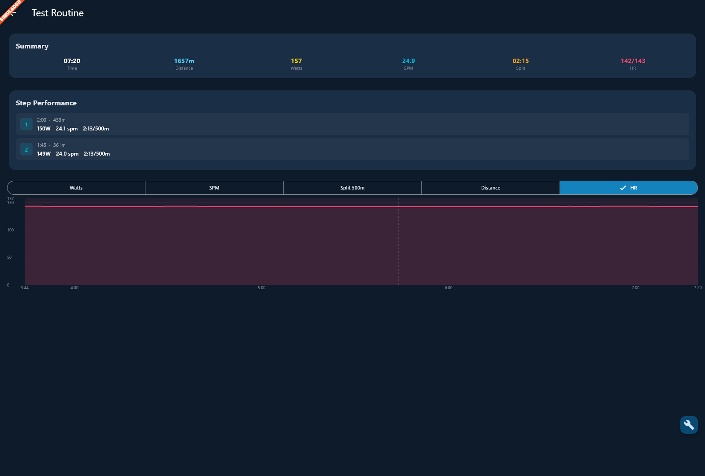
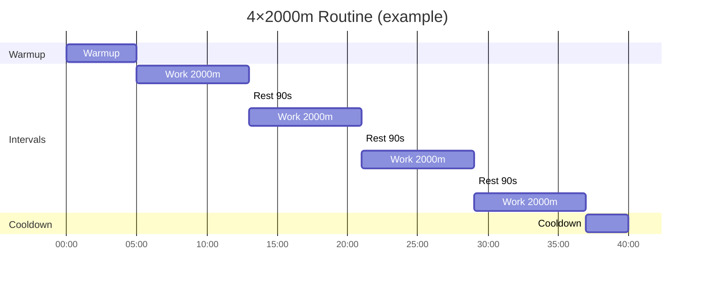

<p align="center">
  
</p>

# RowMate 🚣

**RowMate** is an open-source Flutter app that connects your rowing machine via Bluetooth BLE (using the **FTMS** standard) and helps you manage interval training routines.

> Originally built for the **AMS-670B / Kinomap-XG**, but compatible with **any monitor that implements the FTMS standard**.

---

## Compatible Rowing Machines

RowMate uses the **FTMS (Fitness Machine Service)** protocol — an open Bluetooth SIG standard. If your rowing machine has BLE and supports FTMS, it should work.

| Monitor | Status |
|---------|--------|
| AMS-670B / Kinomap-XG | ✅ Tested |
| Sunny Health & Fitness (SF-RW5623, SF-RW5941, etc.) | ✅ Native FTMS |
| Domyos / Decathlon (R500, R900) | ✅ Native FTMS |
| NordicTrack RW700 / RW900 | ⚠️ Partial |
| WaterRower (with BLE module) | ⚠️ Model dependent |
| Generic BLE rowing machines "FTMS compatible" | ✅ Likely |
| Concept2 (PM5) | ❌ Proprietary protocol |
| Hydrow / Ergatta | ❌ Proprietary protocol |

> **Tested your rowing machine?** Open an [issue](../../issues) or PR to add it to the list 🙌

---

## Bluetooth Protocol

| Element | UUID |
|---------|------|
| FTMS Service | `0x1826` |
| Rower Data (notifications) | `0x2AD2` |
| Heart Rate Service (sensor) | `0x180D` |
| Heart Rate Measurement (notifications) | `0x2A37` |

Parsed metrics: **Split /500m · SPM · Watts · Distance · Calories · Heart Rate**

---

## Heart Rate Sensors

RowMate connects to **any Bluetooth sensor that implements the standard Heart Rate Profile** (`0x180D`): chest straps (Polar, Garmin, Wahoo, Coospo…), armbands, and smartwatches running a broadcaster app. The phone keeps two BLE connections at once: the rower and the sensor.

- **Device tab → "Pulsómetro" card → Buscar**, then tap your sensor. The live bpm shows on the card and on the workout screens.
- The sensor is **remembered**: the app reconnects to it automatically on start and after a drop. **Desconectar** also forgets it.
- Heart rate is stored with every session, shown as **avg/max** in the history and session detail, charted in the detail screen, and included in Strava uploads.

### Smartwatches (Galaxy Watch, Apple Watch)

Watches don't broadcast heart rate over Bluetooth by default: install a broadcaster app that exposes the standard Heart Rate service.

**Galaxy Watch (Wear OS), tested with a Galaxy Watch 7 and [Heart for Bluetooth](https://play.google.com/store/apps/details?id=lukas.the.coder.heartforbluetooth):**

1. On the watch, grant the app **both** permissions: *Body sensors* **and** *Nearby devices* (Bluetooth). Without *Nearby devices* the app shows your pulse but cannot advertise, so nothing will ever find it.
2. Open the app and start an **Activity**: it shows your heart rate ("accuracy high"). Keep that screen open and the watch screen on while pairing.
3. If the sensor still doesn't show up, go to the app's **Connection** tab and tap **Restart Beacon**.
4. In Galaxy Wearable on the phone, allow the app to run in the background.
5. In RowMate, tap **Buscar** on the Pulsómetro card. On Windows the watch appears as *Sensor desconocido* with its address (the advertisement carries no name); on Android/iOS it usually shows its name.

To check whether the watch is actually broadcasting, use **nRF Connect** on the phone: *Scanner* tab, filter by Service UUID `180D`. If the list is empty, the watch app isn't advertising and RowMate can't see it either.

> Simulator mode (`--dart-define=SIMULATOR=true`) replaces the sensor with a simulated one too. To test a real sensor, run without the flag.

---

## Features

- 📡 **BLE scan and auto-reconnect** — connects and recovers from drops automatically
- 📊 **Real-time metrics** — split, SPM, watts, distance, BPM
- ❤️ **Heart rate sensors** — any standard BLE heart rate sensor (chest straps, or a smartwatch with a broadcaster app); remembered and auto-reconnected, avg/max per session (see [Heart Rate Sensors](#heart-rate-sensors))
- 🏋️ **Training routines** — configurable intervals by time or distance
- 🎯 **Targets** — optional watts and SPM goals per step
- 📈 **Session history** — with detailed telemetry and per-step breakdown
- 🔒 **Screen always-on** during workouts
- 🔄 **Strava integration** — upload sessions, sync activities, track sync status
- 🌄 **Immersive workout screen** — 2.5D chase-camera scene: GPU water that reflects the sky, an articulated rower doing the real stroke sequence, scenery passing at your real speed, lighting that follows the time of day, and four sceneries to choose from (alpine lake, city river, coast, regatta course)
- ⏱️ **500 m splits per series** — live 500 m laps in each work step, meters per repetition, and the last 3 repetitions for comparison (collapsible panels), plus the current time
- 🧪 **Simulator mode** — develop and test the UI without a rowing machine (see [Development without a rower](#development-without-a-rower))

---

## Screenshots








---

## Project Structure

```
lib/
├── core/
│   ├── bluetooth/
│   │   ├── ble_service.dart       # BLE connection + subscriptions (rower)
│   │   ├── simulated_ble_service.dart # Fake rower for simulator mode
│   │   ├── ftms_parser.dart       # 0x2AD2 characteristic parser
│   │   ├── heart_rate_service.dart    # Heart rate sensor (0x180D) client + auto-reconnect
│   │   ├── heart_rate_parser.dart     # 0x2A37 characteristic parser
│   │   ├── simulated_heart_rate_service.dart # Fake sensor for simulator mode
│   │   ├── reconnect_loop.dart        # Retry cadence + stale-reading watchdog
│   │   └── scan_filter.dart           # Client-side service filter (Windows/Linux)
│   ├── dev/                       # Simulator mode: flag, physics, control panel
│   ├── database/
│   │   └── database_service.dart  # SQLite (sqflite)
│   ├── models/
│   │   ├── rowing_data.dart        # Real-time metrics
│   │   ├── routine.dart            # Training routine
│   │   ├── interval_step.dart      # Individual step (work/rest)
│   │   └── workout_session.dart    # Saved session + DataPoints
│   └── strava/
│       ├── strava_config.dart      # API URLs and constants
│       ├── strava_secrets.dart     # Credentials (gitignored)
│       ├── strava_auth_service.dart # OAuth2 login/logout/refresh
│       ├── strava_api_service.dart  # Upload, sync, activity streams
│       └── tcx_builder.dart        # TCX XML generator for uploads
├── features/
│   ├── device/        # BLE scan + connection (rower) + heart rate sensor card
│   ├── workout/       # Live workout with routine tracking
│   ├── routines/      # Routine CRUD + step editor
│   ├── history/       # Session history
│   └── profile/       # Strava connection + upload settings
└── shared/
    ├── theme.dart
    └── widgets/
```

---

## Quick Start

### Requirements

- [Flutter SDK](https://docs.flutter.dev/get-started/install) ≥ 3.38
- Android (API 21+), iOS device (15.0+), macOS, or Windows

### Clone and install

```bash
git clone https://github.com/figuibeh/rowmate.git
cd rowmate
flutter pub get
```

### Run

```bash
# Android (with connected device or emulator)
flutter run

# macOS desktop
flutter run -d macos

# Windows desktop
flutter run -d windows

# List available devices
flutter devices
```

### Development without a rower

Simulator mode replaces Bluetooth with a simulated FTMS rower, so you can work on the UI on any platform without hardware:

```bash
flutter run -d windows --dart-define=SIMULATOR=true
```

In VS Code, pick the **RowMate (simulador)** launch configuration.

- The app starts already connected to "Remo simulado", which sends realistic data every second (split derived from watts with the Concept2 formula, plus distance, strokes and calories).
- The heart rate sensor is simulated too: on the Device tab, **Buscar** on the Pulsómetro card lists a "Pulsómetro simulado" whose bpm follows the simulated effort. Real sensors are not scanned in this mode.
- An orange **SIMULADOR** banner is shown. The 🛠 button opens a control panel with:
  - intensity presets;
  - ± watts / SPM;
  - a "Remando" (rowing) switch to stop and resume rowing;
  - a "Simular desconexión" button to test a dropped rower connection;
  - a "Simular caída del pulsómetro" button to test the sensor's auto-reconnect.
- Sessions are saved to a separate database (`rower_app_dev.db`), so test data never mixes with your real history.
- Nothing is ever uploaded to Strava in this mode.

The flag is a compile-time constant. Builds without `--dart-define=SIMULATOR=true`, including every release build, don't include the simulator at all.

---

## Strava Integration (optional)

RowMate can upload your rowing sessions to Strava and sync activities from other devices. **Strava is completely optional** — the app works fully offline without it.

### Setup

1. Go to [developers.strava.com](https://developers.strava.com) and log in with your Strava account
2. Click **Create & Manage Your App** → **Create an App**
3. Fill in the form:
   - **Application Name**: `RowMate` (or any name)
   - **Category**: `Training`
   - **Club**: leave empty
   - **Website**: any URL (e.g. `https://github.com/figuibeh/rowmate`)
   - **Authorization Callback Domain**: `rowmate`
4. Once created, copy your **Client Secret** from the app settings
5. In the project, copy the example secrets file and fill in your secret:

```bash
cp lib/core/strava/strava_secrets.dart.example lib/core/strava/strava_secrets.dart
```

6. Edit `lib/core/strava/strava_secrets.dart`:

```dart
const stravaClientId = '205302';           // RowMate's public client ID
const stravaClientSecret = 'YOUR_SECRET';  // paste your secret here
```

> The `client_id` (`205302`) is RowMate's registered app ID on Strava — it's public and shared across all users. The `client_secret` is personal and **must not be committed to git**.

### Features

- **Upload to Strava**: bulk-upload all unsynced local sessions with one tap
- **Auto-upload**: sessions upload to Strava automatically after finishing (configurable)
- **Ask each time**: shows a dialog after each workout
- **Manual upload**: upload individual sessions from the session detail screen
- **Sync from Strava**: download your rowing activities from Strava to the local history
- **Sync status**: each session in history shows a Strava icon indicating sync status
- **Session auto-repair**: sessions that didn't save properly (e.g. app closed mid-workout) are automatically repaired from telemetry data before uploading
- **Duplicate detection**: re-uploading an already synced session links to the existing Strava activity instead of creating a duplicate

---

## Platform Notes

### Android
- `minSdkVersion 21` required
- BLE permissions already configured in `AndroidManifest.xml`

### iOS
- Physical device required (Bluetooth doesn't work on simulator)
- Bluetooth permissions already set in `Info.plist`

### macOS
- Works out of the box, no extra configuration needed

### Windows
- Requires Visual Studio with the **Desktop development with C++** workload
- Enable **Developer Mode** in Windows settings: Flutter plugins need symlink support
- Bluetooth via `flutter_blue_plus_winrt`; SQLite via `sqflite_common_ffi`
- The WinRT plugin ignores scan service filters, so RowMate filters rower and sensor scans by advertised service UUID on Windows. Devices that don't put their name in the advertisement show up as *Sensor desconocido* / *Unknown device* with their address.

---

## Routines & Interval Steps

A **routine** is a sequence of steps. Each step has a type, a duration (by time or distance), and optional performance targets.

| Step Type | Color | Description |
|-----------|-------|-------------|
| Warmup | 🟡 Yellow | Easy opening phase |
| Work | 🔴 Red | Effort interval |
| Rest | 🟢 Green | Recovery |
| Cooldown | 🔵 Blue | Easy closing phase |

Each step is configured **by time** (min:sec) or **by distance** (meters), with optional **watts** and **SPM** targets that highlight in red during the workout if you fall short.

### Building a Series

You can stack steps to build full training series. A typical interval session looks like this:

```
Warmup (5 min)
  Work (2 min @ 150W+) ─┐
  Rest (1 min)          ├─ repeat × N
  Work (2 min @ 150W+) ─┘
  ...
Cooldown (3 min)
```

Example: a **4×2000m** pyramid might be:



Each step in the editor can have an individual watts/SPM target, so the app warns you in real time when you drop below your goal.

### Progressive Targets in Series

When configuring a **series** (a group of steps that repeat), you can set **progressive targets** that automatically increase with each repetition. This is perfect for ladder workouts and progressive training.

**How it works:**
- When editing a step **inside a series**, you'll see three optional progression fields:
  - **SPM increment (+/rep)**: how much to increase SPM each round (e.g. `+2`)
  - **Watts increment (+/rep)**: how much to increase watts each round (e.g. `+5`)
  - **Split change (+/-/rep)**: how much to change split time each round in seconds (e.g. `-2` to go faster)

**Example: Progressive SPM ladder**
```
Series configuration:
  - 3 repetitions
  - Work: 5 minutes @ 18 SPM
  - Progression SPM: +2
  - Rest: 2 minutes

Result (auto-expanded):
  1st round: 5 min @ 18 SPM
  2 min rest
  2nd round: 5 min @ 20 SPM
  2 min rest
  3rd round: 5 min @ 22 SPM
```

**Multiple progressions:**
You can combine different progression types in the same step:
```
Work: 8 min @ 150W, 22 SPM
  - Watts progression: +10
  - SPM progression: +2

Result:
  Round 1: 150W @ 22 SPM
  Round 2: 160W @ 24 SPM
  Round 3: 170W @ 26 SPM
```

> **Note:** Progression fields only appear when configuring steps inside a series. For standalone steps, they're hidden to avoid confusion.

---

## Contributing

Contributions are welcome! If you have a compatible rowing machine not on the list, or want to add metrics / features, open an issue or a PR.

See [CONTRIBUTING.md](./CONTRIBUTING.md) for guidelines.

---

## License

[MIT](./LICENSE) © 2026 iguisoft
